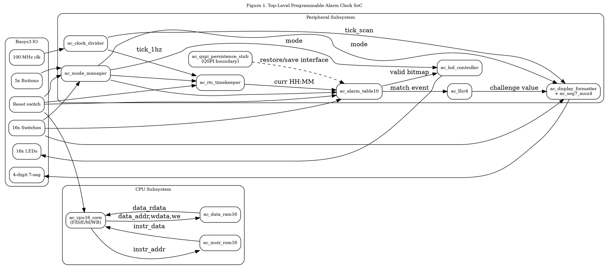
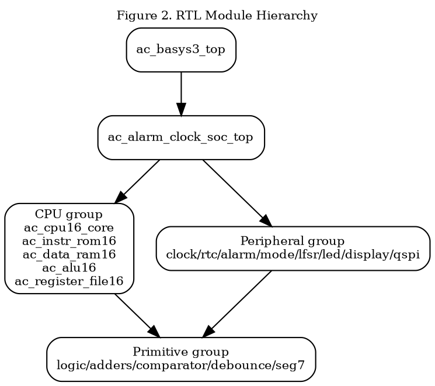
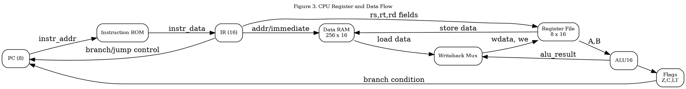
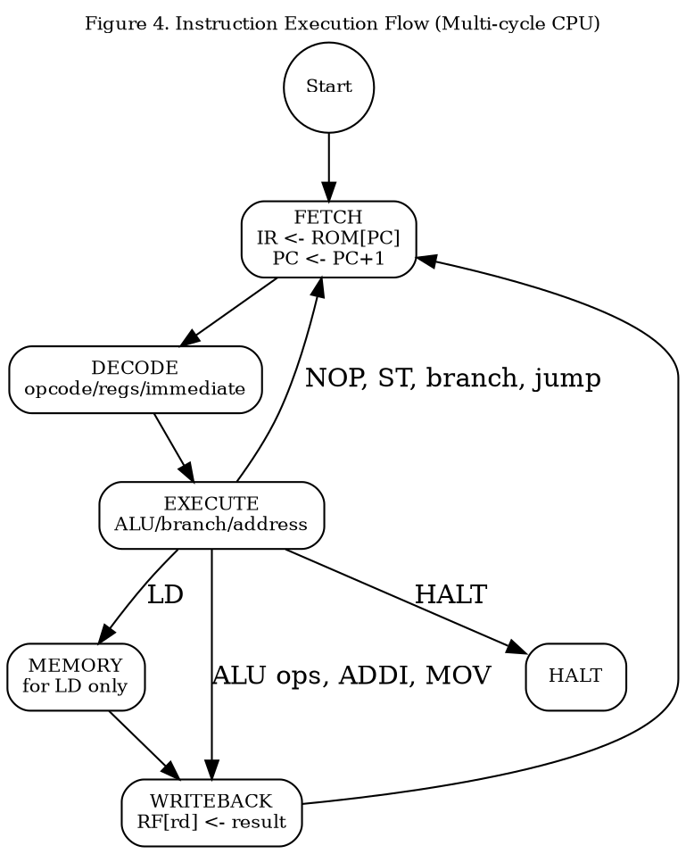
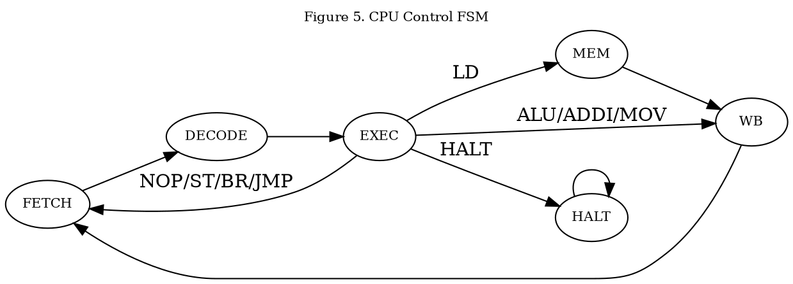
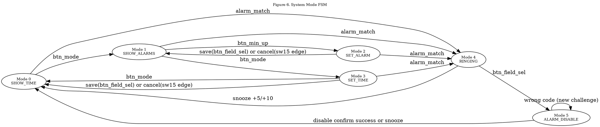
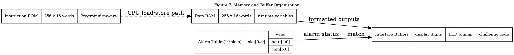

# Programmable Alarm Clock SoC

## Complete Project Report (Basys3 xc7a35tcpg236-1)

## 1. Abstract

This report presents a modular Verilog HDL implementation of a programmable alarm clock system for the Basys3 FPGA board. The design uses a 16-bit custom CPU (Harvard architecture) with a multi-cycle control unit, dedicated alarm-clock peripherals, and strict low-level module decomposition (logic gates, adders, subtractor, comparator, multiplexers, decoders, input conditioning blocks). The system supports six operating modes with constrained transitions, up to ten alarms, real-time timekeeping, alarm matching, snooze and challenge-based disable flows, and visual feedback on LEDs and 7-segment display.

The report includes architecture, ISA, bus/data widths, control FSM flow, module hierarchy, memory and register organization, verification strategy, and FPGA integration guidance. All figures are provided as Graphviz DOT source ready for Graphviz editor compilation.

---

## 2. Project Requirements and Scope

### 2.1 Functional Requirements

| ID    | Requirement                                                     | Implementation Target                         |
| ----- | --------------------------------------------------------------- | --------------------------------------------- |
| FR-1  | Programmable digital system taking inputs and producing outputs | CPU + peripherals + GPIO/display              |
| FR-2  | Register, instruction, and memory operations                    | 16-bit CPU, register file, ROM/RAM            |
| FR-3  | Track current time and trigger alarms                           | RTC + alarm comparator logic                  |
| FR-4  | Support up to 10 alarms                                         | 10-entry alarm table                          |
| FR-5  | Alarm ringing behavior with blinking LEDs                       | LED controller in ringing mode                |
| FR-6  | Random value challenge to stop alarm                            | 4-bit LFSR + switch matching                  |
| FR-7  | 6 operating modes with entry constraints                        | Mode manager + top-level transaction control  |
| FR-8  | Show slot occupancy and selection                               | valid_bitmap + selected LED blink             |
| FR-9  | Snooze operations (+5, +10 minutes)                             | dedicated snooze arithmetic module            |
| FR-10 | Alarm-disable challenge flow                                    | random nibble + compare + retry handling      |
| FR-11 | Error feedback via status LED                                   | 3 pulses at 1s ON/OFF                         |
| FR-12 | Testbench coverage                                              | primitive/cpu/subsystem/integration test plan |

### 2.2 Deliverables

| ID  | Deliverable                          | Status in repository                           |
| --- | ------------------------------------ | ---------------------------------------------- |
| D-1 | Top-level architecture block diagram | Included (Graphviz, Fig. 1)                    |
| D-2 | Register/data-flow diagram           | Included (Graphviz, Fig. 2)                    |
| D-3 | Instruction execution flow           | Included (Graphviz, Fig. 3)                    |
| D-4 | FSM state diagram                    | Included (Graphviz, Fig. 4 and Fig. 5)         |
| D-5 | Memory/buffer/register organization  | Included (Graphviz, Fig. 7)                    |
| D-6 | Modular Verilog RTL                  | Implemented scaffold in structured directories |
| D-7 | Testbenches                          | Starter benches included                       |
| D-8 | Basys3 constraints                   | Constraint plan provided in this report        |

---

## 3. System Architecture

### 3.1 Top-Level Architecture Summary

The architecture is a CPU-centered SoC:

- Control path: 16-bit multi-cycle CPU
- Data path: register file, ALU, ROM, RAM
- Peripheral path: RTC, alarm table, mode manager, random generator, LED/display drivers
- UI path: 16 switches, 5 control buttons, 16 LEDs, 4-digit 7-segment display
- Persistence boundary: QSPI persistence interface module

### 3.2 Figure 1: Top-Level CPU Architecture Block Diagram

Figure 1 caption: Top-level SoC architecture showing CPU core, instruction/data memories, peripherals, and user IO interfaces.



---

## 4. Module Hierarchy and Component Inventory

### 4.1 Module Inventory Table

| Group       | Module                   | Responsibility                              |
| ----------- | ------------------------ | ------------------------------------------- |
| Top         | ac_basys3_top            | Board IO mapping and wrapper                |
| Top         | ac_alarm_clock_soc_top   | Full system integration                     |
| CPU         | ac_cpu16_core            | Multi-cycle CPU control and execution       |
| CPU         | ac_alu16                 | ALU result and flags                        |
| CPU         | ac_register_file16       | 8 x 16-bit general-purpose registers        |
| CPU         | ac_instr_rom16           | Program storage model                       |
| CPU         | ac_data_ram16            | Data storage model                          |
| Peripherals | ac_clock_divider         | 1 Hz and scan-rate ticks                    |
| Peripherals | ac_rtc_timekeeper        | Time counter (HH:MM:SS)                     |
| Peripherals | ac_alarm_table10         | 10-slot alarm storage and comparator        |
| Peripherals | ac_mode_manager          | Debounced mode and control pulse generation |
| Peripherals | ac_lfsr4                 | 4-bit pseudo-random code                    |
| Peripherals | ac_led_controller        | LED status policy per mode                  |
| Peripherals | ac_display_formatter     | Display content formatting by mode          |
| Peripherals | ac_qspi_persistence_stub | Flash persistence interface boundary        |
| Primitives  | ac_logic_gates           | AND/OR/XOR/NOT, 2:1 mux                     |
| Primitives  | ac_half_full_adder       | Basic arithmetic blocks                     |
| Primitives  | ac_ripple_adder16        | 16-bit adder chain                          |
| Primitives  | ac_adder_subtractor16    | Add/sub block                               |
| Primitives  | ac_comparator16          | Comparator block                            |
| Primitives  | ac_debouncer             | Input debouncing                            |
| Primitives  | ac_edge_pulse            | Rising-edge pulse generation                |
| Primitives  | ac_bcd_to_7seg           | BCD to 7-segment decoder                    |
| Primitives  | ac_seg7_mux4             | 4-digit display scanning                    |

### 4.2 Figure 2: Module Hierarchy Diagram

Figure 2 caption: Hierarchical decomposition from board top-level to primitive modules.



---

## 5. Datapath, Buses, and Register-Level Organization

### 5.1 Key Widths and Interfaces

| Signal/Bus          | Width | Description                   |
| ------------------- | ----: | ----------------------------- |
| CPU data path       |    16 | ALU and register operations   |
| Instruction address |     8 | 256 instruction words         |
| Data address        |     8 | 256 data words                |
| Register index      |     3 | 8 general registers           |
| Alarm slot index    |     4 | Supports 10 slots (0-9)       |
| Hour                |     5 | 0-23                          |
| Minute/Second       |     6 | 0-59                          |
| Switch inputs       |    16 | mode-dependent user input     |
| LED outputs         |    16 | occupancy and ring indicators |

### 5.2 CPU Register Set

| Register    | Width | Role                        |
| ----------- | ----: | --------------------------- |
| r0          |    16 | constant zero by convention |
| r1-r7       |    16 | general-purpose             |
| PC          |     8 | program counter             |
| IR          |    16 | instruction register        |
| FLAGS.zero  |     1 | zero result/compare         |
| FLAGS.carry |     1 | carry/borrow indicator      |
| FLAGS.lt    |     1 | less-than indicator         |

### 5.3 Figure 3: Register Connection and Data Flow Diagram

Figure 3 caption: CPU datapath and register data movement with ALU and memory interactions.



---

## 6. ISA Specification

### 6.1 Instruction Word Format (16-bit)

| Bits    | Field  | Description                                            |
| ------- | ------ | ------------------------------------------------------ |
| [15:12] | opcode | operation selector                                     |
| [11:9]  | rd     | destination register                                   |
| [8:6]   | rs     | source register A                                      |
| [5:3]   | rt     | source register B                                      |
| [5:0]   | imm6   | 6-bit immediate (sign-extended where required)         |
| [7:0]   | imm8   | jump target / address fragment (instruction dependent) |

### 6.2 Opcode Table

| Opcode | Mnemonic | Type    | Description                     |
| ------ | -------- | ------- | ------------------------------- |
| 0x0    | NOP      | Control | No operation                    |
| 0x1    | ADD      | R-type  | rd = rs + rt                    |
| 0x2    | SUB      | R-type  | rd = rs - rt                    |
| 0x3    | AND      | R-type  | rd = rs AND rt                  |
| 0x4    | OR       | R-type  | rd = rs OR rt                   |
| 0x5    | XOR      | R-type  | rd = rs XOR rt                  |
| 0x6    | ADDI     | I-type  | rd = rs + imm6                  |
| 0x7    | LD       | I-type  | rd = MEM[rs + imm6]             |
| 0x8    | ST       | I-type  | MEM[rs + imm6] = rt             |
| 0x9    | BEQ      | I-type  | if rs == rt, branch by imm6     |
| 0xA    | BNE      | I-type  | if rs != rt, branch by imm6     |
| 0xB    | JMP      | J-type  | PC = imm8                       |
| 0xC    | HALT     | Control | Stop execution                  |
| 0xD    | MOV      | R-type  | rd = rs                         |
| 0xE    | CMP      | R-type  | compare rs and rt, update flags |

---

## 7. Instruction Execution and Control Unit FSM

### 7.1 Multi-Cycle CPU States

- Fetch: read instruction from ROM using PC
- Decode: parse fields/op type
- Execute: ALU operation, branch decision, or memory address prep
- Memory: read for LD
- Writeback: write ALU or load result to register file
- Halt: processor stopped

### 7.2 Figure 4: Instruction Execution Flow

Figure 4 caption: Cycle-level execution flow for the CPU control path.



### 7.3 Figure 5: CPU Control Unit State Machine

Figure 5 caption: CPU finite state machine and legal transitions.



---

## 8. Alarm Modes and User Interaction FSM

### 8.1 Operating Modes

| Mode ID | Name          | Behavior                                            |
| ------: | ------------- | --------------------------------------------------- |
|       0 | Show Time     | Display current HH:MM                               |
|       1 | Show Alarms   | Browse selected slot, show HH:MM or AAAA            |
|       2 | Set Alarm     | Edit selected slot HH:MM, duplicate-check on save   |
|       3 | Set Time      | Edit RTC HH:MM staging buffer and commit            |
|       4 | Ringing       | Display ALrM, blink all LEDs                        |
|       5 | Alarm Disable | Display challenge + OF, confirm hex input or snooze |

### 8.2 Mode Inputs

| Input         | Source     | Function                                                                         |
| ------------- | ---------- | -------------------------------------------------------------------------------- |
| btn_mode      | pushbutton | cycle `0 -> 1 -> 3 -> 0`; minute increment in mode 2; snooze +5 in modes 4/5     |
| btn_confirm   | pushbutton | slot increment in mode 1; hour increment in mode 2; disable confirm in mode 5    |
| btn_hour_up   | pushbutton | slot decrement in mode 1; hour decrement in modes 2/3                            |
| btn_min_up    | pushbutton | enter mode 2 from mode 1; minute decrement in modes 2/3; snooze +10 in modes 4/5 |
| btn_field_sel | pushbutton | clear selected slot in mode 1; save in modes 2/3; enter mode 5 from mode 4       |
| sw[3:0]       | switches   | challenge input in mode 5                                                        |
| sw[15] edge   | switch     | cancel toggle in modes 2 and 3                                                   |

### 8.3 Figure 6: Mode Manager FSM

Figure 6 caption: User mode state machine for top-level behavior selection.



---

## 9. Memory, Buffer, and Alarm Organization

### 9.1 Memory Map (logical)

| Region                           | Address Range |         Width | Purpose                      |
| -------------------------------- | ------------- | ------------: | ---------------------------- |
| Instruction ROM                  | 0x00-0xFF     |            16 | Program words                |
| Data RAM                         | 0x00-0xFF     |            16 | Variables and software state |
| Alarm table (logical peripheral) | slot 0..9     | HH:MM + valid | Alarm schedule storage       |
| Flags/register buffers           | internal      |         mixed | Control and arithmetic state |

### 9.2 Alarm Slot Format

| Field  | Bits | Notes               |
| ------ | ---: | ------------------- |
| valid  |    1 | slot in use         |
| hour   |    5 | 0-23                |
| minute |    6 | 0-59                |
| total  |   12 | compact slot record |

### 9.3 Arbitration Policy

If multiple alarms match the current minute, the lowest slot index is selected first and remaining slots are serviced afterward.

### 9.4 Figure 7: Memory and Buffer Organization

Figure 7 caption: Logical organization of instruction memory, data memory, alarm slots, and interface buffers.



---

## 10. Verification Strategy and Coverage Plan

### 10.1 Verification Levels

| Level       | Scope             | Method                              |
| ----------- | ----------------- | ----------------------------------- |
| Unit        | Primitive modules | directed vectors and assertions     |
| Unit        | CPU blocks        | opcode-specific micro-tests         |
| Subsystem   | peripherals       | mode/alarm/time/rng tests           |
| Integration | SoC top           | scenario-driven waveform validation |
| Hardware    | Basys3            | bring-up and user-flow testing      |

### 10.2 Test Matrix

| Test ID            | Testbench / Method       | Target                                        |
| ------------------ | ------------------------ | --------------------------------------------- |
| TB-PRIM-ADD        | tb_ac_ripple_adder16     | adder correctness/carry behavior              |
| TB-CPU-SMOKE       | tb_ac_cpu16_smoke        | CPU fetch/decode/loop behavior                |
| TB-SNOOZE          | tb_ac_snooze_calc        | +5/+10 rollover at minute/hour/day boundaries |
| TB-MODE-FSM-6MODE  | tb_ac_mode_manager_6mode | constrained cycle and force-mode behavior     |
| TB-RTC-ROLLOVER    | planned                  | 23:59:59 -> 00:00:00                          |
| TB-ALARM-MATCH     | planned                  | slot compare and priority                     |
| TB-DISABLE-FLOW    | planned                  | mode 5 confirm/retry/snooze behavior          |
| TB-DISPLAY-SYMBOLS | planned                  | ALrM and OF symbol rendering                  |
| TB-LED-POLICY      | planned                  | occupancy, mode indicators, error status      |
| TB-PERSIST         | planned                  | save/load alarm dataset                       |

### 10.3 Coverage Goals

- Opcode coverage: 100% of implemented opcodes
- Mode coverage: all 6 modes exercised
- Alarm coverage: add/show/match/clear with 10 slots
- Edge cases: reset behavior, empty/full alarm set, simultaneous matches

---

## 11. FPGA Integration and Constraint Plan (Basys3)

### 11.1 Top-Level Pin Intent

| Top Port                 | Basys3 Resource            |
| ------------------------ | -------------------------- |
| clk                      | 100 MHz onboard oscillator |
| sw[15:0]                 | 16 slide switches          |
| btnU/btnD/btnL/btnR/btnC | 5 pushbuttons              |
| led[15:0]                | 16 LEDs                    |
| an[3:0], seg[6:0]        | 4-digit 7-segment display  |

### 11.2 Constraint Checklist

1. Create or import Basys3 master XDC.
2. Map all top ports from ac_basys3_top.
3. Apply clock constraint (100 MHz).
4. Confirm IO standards (LVCMOS33).
5. Validate no unconstrained ports remain.

### 11.3 Timing Targets

| Metric       | Target                |
| ------------ | --------------------- |
| System clock | 100 MHz               |
| Display scan | 400 Hz tick source    |
| RTC update   | 1 Hz                  |
| LED blink    | 2 Hz effective toggle |

---

## 12. Implementation Status and Roadmap

### 12.1 Implemented in RTL

- Structured hierarchy with top/cpu/peripherals/primitives folders
- Multi-cycle CPU scaffold with documented ISA mapping
- 6-mode constrained behavior with dedicated ringing/disable paths
- RTC, alarm table with duplicate check, mode manager, LFSR, snooze arithmetic
- Symbol-based display formatting (including ALrM and challenge/OF pattern)
- LED policy with occupancy, mode indicators, ringing blink, and status LED handling
- Basys3 wrapper and integration top module
- Starter plus focused redesign testbenches (snooze + mode manager)

### 12.2 Pending for Completion

- Replace QSPI persistence stub with full runtime flash transaction controller
- Add full subsystem/integration regressions for disable and error timing
- Expand CPU opcode regression suite beyond smoke level
- Run synthesis/implementation timing closure and board-level validation

---

## 13. Reproducibility Instructions

1. Open dsd_project.xpr in Vivado.
2. Add new RTL folders under dsd_project.srcs/sources_1/new.
3. Set top module to ac_basys3_top.
4. Add XDC constraints for Basys3.
5. Run synthesis/implementation/bitstream.
6. Run testbenches from dsd_project.sim/tb.
7. Validate all 6 modes and ring/disable/snooze scenarios on hardware.

---

## 14. Conclusion

This project delivers a robust and modular architecture for a programmable alarm clock digital system on Basys3. The design satisfies the required academic structure: clear architecture, defined datapath and control path, explicit module hierarchy, instruction format and execution flow, FSM-based control behavior, and test planning. The included Graphviz figures and tables provide report-ready engineering documentation suitable for submission and design review.

---

## Appendix A: Graphviz Rendering Tips

Use any Graphviz editor and paste each DOT block directly. CLI example:

```bash
dot -Tpng fig1.dot -o fig1.png
dot -Tsvg fig1.dot -o fig1.svg
```

For Markdown preview pipelines, either embed generated images or use a Graphviz-enabled markdown renderer.
